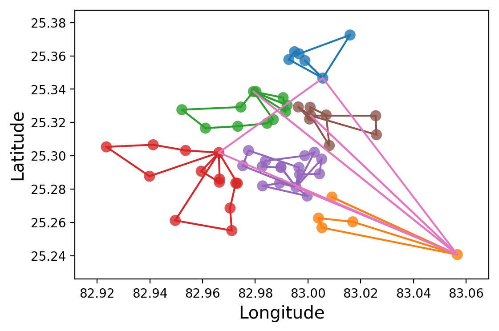

# Clustering-VRP
Uses clustering algo to optimize VRP solutions

Google Cloud API is used to get Distance and Time data.
An Algorithm is built on top of Google OR-Tools to optimize VRP solution.

This code originally was written by my wife for her Industrial Engineering [Ph.d thesis](https://www.emerald.com/insight/content/doi/10.1108/JAMR-12-2018-0113/full/html). I have put a copy here so that it may help other researchers.

